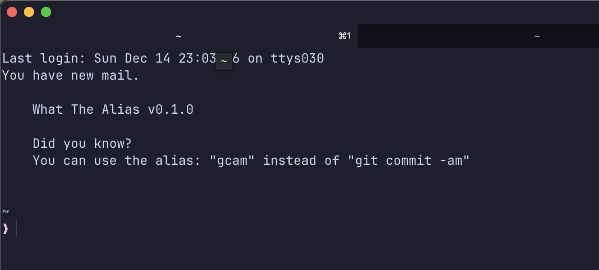

# What The Alias



Recursively scans shell config files and collects alias definitions in order to:

- remind you of a random alias
- search for an alias
- train new aliases with spaced repetition (coming soon)
- instant search for an alias (coming sooner)

## Shell alias trainer

I put a call to this tool into my `.zshrc`. Every time I open a terminal, I get reminded of one of the aliases I defined. This allows me to make even more use of aliases. In the past I often forgot that I even defined an alias, or what it was exactly.

## Installation

WTA is written in Rust, and you can compile the executable from source via:

`cargo build --release`

You then find the executable at: `target/release/wta`. Include this directory in your system path, or copy/move the executable as you see fit.

## Usage:

### Quickly search for an alias:

`wta <phrase to search>`

For example:

```
$ wta git

    What The Alias v0.2.0

    Searching for: git

    "gco" => "git checkout"
    "gst" => "git status"
    "gd" => "git diff -w"
    "gl" => "git log --graph --oneline --all"
    "gcam" => "git commit -am"

```

### Get reminded of a random alias:

`wta reminder --random`

For example:

```
$ wta reminder --random

    What The Alias v0.2.0

    Did you know?
    You can use the alias: "gd" instead of "git diff -w"

```

## Supported shells

- Bash (`.bashrc`)
- Zsh (`.zshrc`)

## Roadmap

Upcoming features:

### Search aliases

Rough plan to implement this:

- phase 1: search by calling `wta` with arguments
- phase 2: interactive instant search

### Spaced repetition reminder

Spaced repetition will help enforce the learning of new aliases.

Rough plan to implement this:

- collect and sync found aliases to a local SQLite database
- record last timestamp of last reminder, and count of how often reminded already
